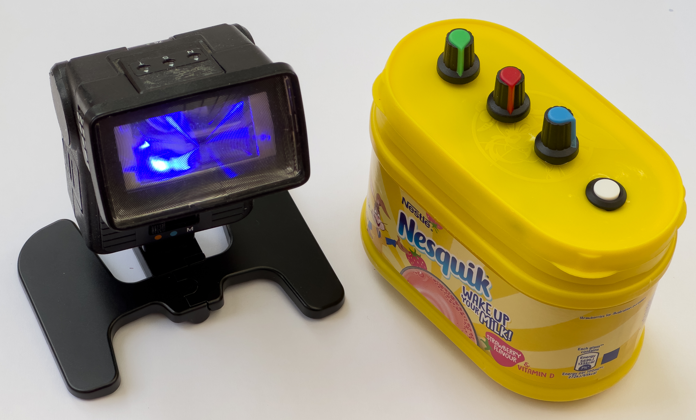
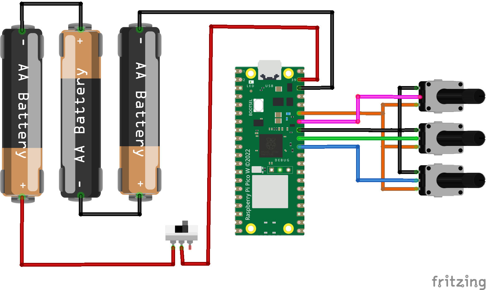

# PICO-Bluetooth-Flashlight
Bluetooth controlled light 

This is the flashgun light and the controller built into a milkshake box.
## Building a remote control

This is the circuit for the device. 

You will need:

* An old box (or you can put the controller into anything you fancy).
* A Raspberry Pi PICO W.
* Three 10K linear potentiometers  
## Software
The software uses Micro Python. Install Micro Python and then copy all the .py files in this repository onto the device. 

If you want the device to be a controller, copy the file ble_sender.py to main.py. If you want the device to be light, copy the file ble_receiver.py to main.py.

Have fun!
Rob Miles